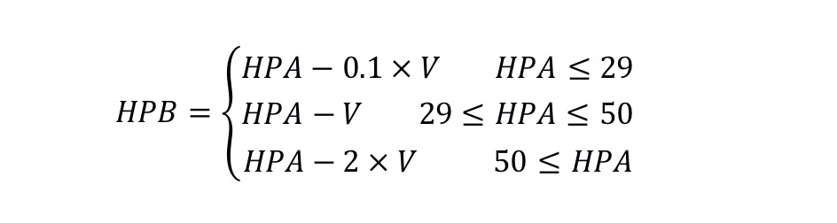
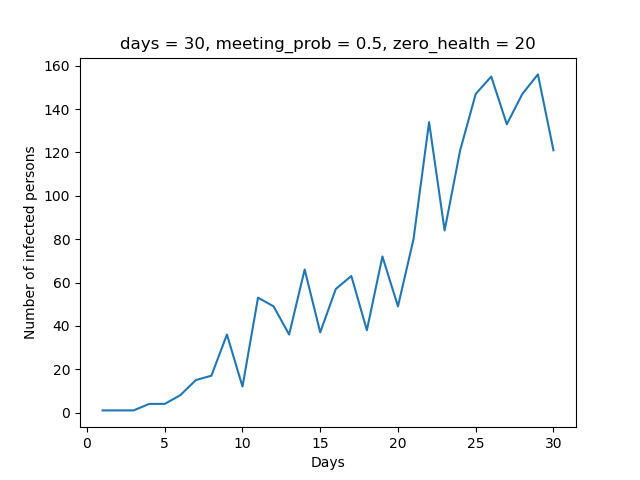

# Virus propagation simulation

##  Requirement
- python 3.7
- numpy
- scipy
- matplotlib
- pandas

## Introduce

1. The list of friends is A2_ sample_ set.txt  , the first one in each line is the name, followed by the person's friends.
3. Determine each person's physical condition through health points. The highest health score is 100, and the lowest is 0; people below 50 are considered infected and can infect others.
4. Every day, everyone has a certain probability to visit all his friends. The probability range is 0 to 1. If it is 0, it means that he will not see anyone. If it is 0.5, the probability of meeting every friend is 50%. This probability is defined as probability.
5. The infected person will produce the virus and spread the virus in each visit. Among them, V is the amount of virus transmitted, HC is the number of health points of the infected. However, the number of health points contacted with communicators is calculated as follows:

6. It represents the initial health points of each person on the day and the health points after contacting the infected person. Health points are rounded.
At the end of each day, each person will increase 5 health points.

# Detail

- Create a class called 'person', which can represent the social connection between this person and his friends. A variable is also needed to track his name and health score.
- Another function is defined as load_ People (), which can read the contents of the txt file; and create a class named person for each line, which has the names in the file; if they have friends, add the names of friends through addFriend (); finally, return to the list
- Task 1 can build social networks, and task 2 can simulate the spread of disease. Create a class named "patient" by inheriting Task1. The specific requirements are in task2.py. If necessary, you can create a new method.
- Define a function named load_ Patients (), requirements and load_ Similar to people(), it can read the contents of the txt file and assign a default to everyone_ Health, initial health score.
- Define a function named run_ Simulation () is used to simulate the spread of disease. By days, probability of visit, and zero_ Health) as an argument. Through load_ Patients () to introduce patients, where the first person in the first line of the txt file is the initial patient, and his friend health score is 75. Use this function to calculate the visit every day (use random(), if it is greater than the visit probability, it will be regarded as the visit); if the visit is generated, and one person is infected, trigger affect(), and calculate the virus volume V; check the number of infected people and record after all the visits are completed; at the end of the day, use sleep() to recover 5 health points.
- Finally get the number of infected people every day. For example, if the number of days is 30, you will get 30 infected persons.

